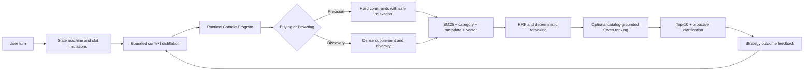

# ContextCart

ContextCart is an adaptive conversational shopping agent for the TikTok TechJam
2026 Conversational E-Commerce Search Challenge. It separates high-intent
**Buying** requests from open-ended **Browsing**, combines keyword, category,
metadata, and vector retrieval in memory, and compiles a bounded Context Program
on every turn so the retrieval and clarification strategy can change with the
conversation.

The default submission is deterministic, offline-capable, catalog-grounded, and
safe under missing optional models. A local Qwen3.5 semantic ranker is implemented
and evaluated, but remains disabled by default because its measured latency and
MTTC trade-off did not pass our deployment gate.

## Why it matters

Traditional keyword search treats every message as a static query. Real shoppers
switch between discovery and purchase, add constraints over time, reject prior
results, and sometimes replace the entire goal. ContextCart models those changes
explicitly while returning valid Top-10 products on every turn.

## Architecture



### Competition pillars

| Requirement | Implementation |
|---|---|
| Buying/Browsing dual-track routing | Intent probability selects distinct precision or discovery execution plans. |
| Multi-route retrieval | In-memory SQLite FTS5 BM25, category, metadata, and hashing/BGE dense routes with deterministic RRF. |
| LLM semantic ranking | Optional local Ollama `qwen3.5:9b` can only permute a catalog-grounded candidate set; invalid output falls back safely. |
| Multi-turn state | Structured slots accumulate; full, category, and attribute-level overrides erase only stale evidence. |
| Proactive guidance | Over-general requests cut off expensive routes and ask one high-information clarification. |
| Personalized context distillation | Bounded short-term evidence plus explicit-ID, privacy-safe in-memory long-term preferences. |
| Adaptive orchestration | Each turn compiles and revises an immutable Context Program from state, probe results, failures, and prior outcomes. |
| HR@10, MRR, MTTC | The unmodified official evaluator and reproducible experiment wrapper report all required metrics. |

## Repository layout

```text
agent.py                         canonical submission entry point
starter/agent.py                 adapter used by the official default evaluator
starter/baseline_agent.py        preserved weak BM25 starter
solution/                        final agent, retrieval, ranking, dialogue, context
evaluator/local_evaluator.py     unmodified official evaluator
experiments/                     frozen split, run, comparison, and failure tools
demo/app.py                      lightweight local web presentation
demo/_assets/webapp/index.html   self-contained presentation frontend
demo/cli_demo.py                 terminal-only three-turn fallback demo
tests/                           contract, retrieval, dialogue, LLM, and demo tests
docs/                            technical reports, Devpost text, and demo runbook
```

## Requirements

- Python 3.10 or newer. The final verification used Python 3.14.3 on Windows 11.
- Approximately 40 MB of disk for the generated hashing dense index.
- Enough memory for the 50K product catalog, FTS index, and float32 search matrix.
- No network, API key, hosted LLM, or external vector database is required by the
  default Agent.

Optional components:

- Ollama with `qwen3.5:9b` for the measured semantic-ranking ablation.
- ONNX Runtime GPU and BGE for the optional neural dense experiment.
- A modern browser for the optional local presentation page.

## Setup

### 1. Create an environment

PowerShell:

```powershell
py -3.11 -m venv .venv
.\.venv\Scripts\python.exe -m pip install --upgrade pip
.\.venv\Scripts\python.exe -m pip install -r requirements.txt
```

Linux/macOS:

```bash
python3 -m venv .venv
.venv/bin/python -m pip install --upgrade pip
.venv/bin/python -m pip install -r requirements.txt
```

### 2. Place and verify the frozen catalog

Download `catalog.jsonl.gz` from the organizer's
[participant-kit release](https://github.com/TechJam2026/techjam-conversational-search/releases/tag/participant-kit),
decompress it, and place it at `data/catalog.jsonl`.

Expected SHA256:

```text
da979b05a68af864cb0dcf9ee6a81c010c7e66a57978ad286c7a2e005fc69a67
```

PowerShell verification:

```powershell
(Get-FileHash data\catalog.jsonl -Algorithm SHA256).Hash.ToLower()
```

The catalog is intentionally ignored by Git and is never modified by the Agent.

### 3. Build the default offline dense index

```powershell
.\.venv\Scripts\python.exe scripts\build_embeddings.py --backend hashing
```

The generated artifacts are ignored by Git. If they are missing or their catalog
SHA does not match, Dense retrieval is disabled safely and the remaining routes
continue to run.

## Run the official evaluator

The organizer's default command now resolves through `starter.agent:Agent` to the
final solution without modifying `evaluator/local_evaluator.py`:

```powershell
.\.venv\Scripts\python.exe -m evaluator.local_evaluator
```

The canonical standalone entry is also available as `agent:Agent`. To reproduce
the preserved weak starter instead, use the experiment wrapper with
`starter.baseline_agent:Agent`.

## Reproduce the reported dev150 result

The public 200 sessions are split deterministically into 150 tuning sessions and
50 frozen holdout sessions. The commands below recreate only the split, verify
its hashes, and run the tuning configuration:

```powershell
.\.venv\Scripts\python.exe -m experiments.split_public_set
.\.venv\Scripts\python.exe -m experiments.verify_frozen_data
.\.venv\Scripts\python.exe -m experiments.run_experiment `
  --config experiments\configs\context_programming_dev.json
```

Do not use the 50-session holdout for tuning. Generated splits and run directories
are ignored by Git; tracked summaries under `experiments/analysis/` retain hashes
and aggregate evidence.

### Current default metrics

| Metric | dev150 |
|---|---:|
| Hit Rate@10 | **0.920000** |
| MRR | **0.607254** |
| MTTC | **4.360000** |
| Efficiency | **0.664000** |
| TechnicalScore | **0.774976** |
| End-to-end elapsed time | 196.13 s |

Dataset SHA256: `c8955cacd79bb2e2ed6b984979bca91f379fc699648c5bc2e3ac2efb37f8b22a`.
These are development results, not a claim about the organizer's private 800
sessions.

## Local demo

Launch the local-only page; it uses the same solution dependencies and a
repository-native HTML/CSS/JavaScript frontend:

```powershell
.\.venv\Scripts\python.exe demo\app.py
```

Open <http://127.0.0.1:7860> and wait for **System Ready**. The page shows the
multi-turn conversation, Top-10 catalog products, retrieval routes, distilled
context, Context Program, constraints, cutoff decision, and fallback status.

Terminal-only fallback:

```powershell
.\.venv\Scripts\python.exe demo\cli_demo.py
```

See [`demo/README_ZH.md`](demo/README_ZH.md) and
[`docs/DEMO_RUNBOOK_ZH.md`](docs/DEMO_RUNBOOK_ZH.md) for the exact presentation
script.

## Optional local Qwen3.5

```powershell
ollama pull qwen3.5:9b
.\.venv\Scripts\python.exe scripts\test_ollama_integration.py
```

Qwen is **not enabled by default**. On the same dev150 split it kept HR@10 at
0.92, improved MRR from 0.607254 to 0.620931, slightly worsened MTTC from 4.36
to 4.38, produced a 12.36% strict-fallback rate, and took 24.48 times as long.
The deployment gate therefore failed. This choice preserves the faster,
deterministic offline path while retaining the fully implemented semantic-ranking
boundary for future optimization.

## Tests

```powershell
.\.venv\Scripts\python.exe -m unittest discover -s tests -v
.\.venv\Scripts\python.exe -m compileall -q agent.py starter solution demo experiments scripts tests
```

The tests cover API contracts, catalog grounding, deterministic fusion, constraint
relaxation, intent overrides, over-generality recovery, profile isolation, Context
Programs, Qwen validation/fallback, and local presentation helpers.

## Safety and compliance

- The official evaluator is unchanged.
- Every recommended ID originates from the read-only catalog and is deduplicated.
- Catalog mutation and mock ASIN generation are prohibited by design.
- Dense artifacts are enabled only when complete and catalog-SHA compatible.
- Missing Dense/LLM dependencies degrade safely rather than breaking Agent startup.
- The default run is local and offline; no credentials or secrets are required.
- Anonymous sessions cannot write cross-session profile memory.
- The 10-turn competition limit is enforced by the evaluator and local demo.

## Limitations

- The tracked development evidence covers 150 public sessions; private-set
  generalization remains unknown.
- Hashing Dense is practical and reproducible but less semantic than a full BGE
  embedding model.
- Price coverage is incomplete in the catalog, so budget filters must relax
  conservatively.
- Long-term profiles are in-memory and intentionally disappear when the process
  exits.
- Qwen improves some ranks but currently misses the latency, MTTC, and strict
  output-validity gate.
- The 50K in-memory matrix and FTS index are designed for the challenge scale,
  not multi-tenant production traffic.

## What we would improve next

1. Quantize or ANN-index the full BGE matrix while preserving the catalog-SHA gate.
2. Distill semantic ranking into a faster local scorer with strict latency bounds.
3. Improve typed category extraction and price-field calibration from audited
   failure cases.
4. Add encrypted, revocable profile persistence only with explicit user consent.
5. Validate once on a newly frozen unseen split after all weights are locked.

## Development tools and libraries

- VS Code and Git
- Python standard library, SQLite FTS5, NumPy
- FastEmbed / ONNX Runtime for optional BGE
- FlashRank for the optional cross-encoder boundary
- Ollama `qwen3.5:9b` for local semantic-ranking experiments
- Repository-native HTML/CSS/JavaScript and Python's standard-library HTTP server
  for the presentation-only local UI

## Team contribution

This submission is currently documented as a **solo project**: architecture,
retrieval, dialogue state, context programming, experiments, testing,
documentation, and demo integration were completed by the repository owner. If
the final Devpost team has additional members, replace this paragraph with the
exact member names and contributions before submission.

## Data and attribution

The competition catalog and sessions are derived from
[Amazon Reviews 2023](https://amazon-reviews-2023.github.io/) by McAuley Lab,
UCSD, using the `Clothing_Shoes_and_Jewelry` category and `parent_asin` product
identifier. See [`DATA_ATTRIBUTION.md`](DATA_ATTRIBUTION.md). Product text is
used only as frozen competition input; this repository does not redistribute the
50K catalog, product images, private sessions, model files, or credentials.

## Submission documents

- [`docs/DEVPOST_DESCRIPTION.md`](docs/DEVPOST_DESCRIPTION.md) — ready-to-paste Devpost copy
- [`docs/DEMO_RUNBOOK_ZH.md`](docs/DEMO_RUNBOOK_ZH.md) — local and video demo flow
- [`docs/COMPETITION_REQUIREMENTS_STATUS_ZH.md`](docs/COMPETITION_REQUIREMENTS_STATUS_ZH.md) — requirement audit
- [`docs/QWEN35_CONTEXT_DEV_ABLATION_ZH.md`](docs/QWEN35_CONTEXT_DEV_ABLATION_ZH.md) — measured Qwen decision
